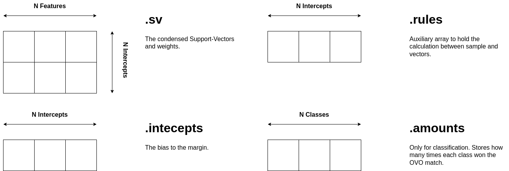

Machine Learning
======

## Support-Vector Machines

The structure to implement an SVM is available by including the header `teil/model/svm/svc.h` for classification problems or the `teil/model/svm/svr.h` for regression problems.

The existing `svc_model_t` and `svr_model_t` structures are equal, except that the `svc_model_t` will include arrays to hold the amounts, rnges, and a variable to store the number of classes.

The structures are the following:

```c
typedef struct{
    unsigned int n_support;
    unsigned int n_intercepts;
    unsigned int n_classes;
    unsigned int n_features;
    unsigned int * amounts;
    unsigned int * ranges;
    enum KERNELS kernel;
    unsigned short int  degree;
    feature_type coef;
    feature_type gamma;
    feature_type * sample;
    feature_type * kernels;
    void * support_vectors;
    void * weights;
    feature_type * intercepts;
    feature_type * decision_rules;
} svc_model_t;
```

```c
typedef struct{
    unsigned int n_support;
    unsigned int n_features;
    enum KERNELS kernel;
    unsigned short int  degree;
    feature_type coef;
    feature_type gamma;
    feature_type * sample;
    feature_type * kernels;
    void * support_vectors;//[][];
    feature_type * weights;
    feature_type intercepts;
    feature_type decision_rules;

} svr_model_t;
```

The next sections explain what each structure field maps regarding the original SVM model. 

### Linear 

The following figure depicts the Linear SVM structure and the respective explanation.




## Multi-Layer Percepton

## Decision Tree
