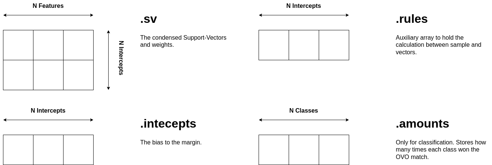
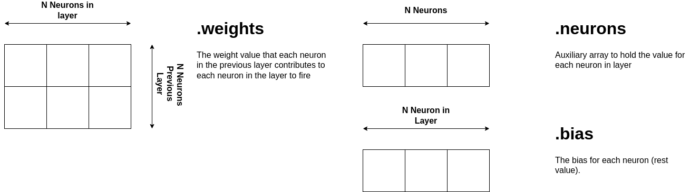

Machine Learning
======

## Support-Vector Machines

The structure to implement an SVM is available by including the header `teil/model/svm/svc.h` for classification problems or the `teil/model/svm/svr.h` for regression problems.

The existing `svc_model_t` and `svr_model_t` structures are equal, except that the `svc_model_t` will include arrays to hold the amounts, rnges, and a variable to store the number of classes.

The structures are the following:

```c
typedef struct{
    unsigned int n_support;
    unsigned int n_intercepts;
    unsigned int n_classes;
    unsigned int n_features;
    unsigned int * amounts;
    unsigned int * ranges;
    enum KERNELS kernel;
    unsigned short int  degree;
    feature_type coef;
    feature_type gamma;
    feature_type * sample;
    feature_type * kernels;
    void * support_vectors;
    void * weights;
    feature_type * intercepts;
    feature_type * decision_rules;
} svc_model_t;
```

```c
typedef struct{
    unsigned int n_support;
    unsigned int n_features;
    enum KERNELS kernel;
    unsigned short int  degree;
    feature_type coef;
    feature_type gamma;
    feature_type * sample;
    feature_type * kernels;
    void * support_vectors;//[][];
    feature_type * weights;
    feature_type intercepts;
    feature_type decision_rules;

} svr_model_t;
```

The next sections explain what each structure field maps regarding the original SVM model. 

### Structure Reference (Linear Kernel)

The following figure depicts the Linear SVM structure and the respective explanation.
If you use other ML library but Scikit-Learn, please ensure that you copy each structure correctly.
Follow the Scikit-Learn documentation to further understand what each structure represents.


### Structure Reference (Other Kernels)

The following figure depicts the SVM structure and the respective explanation. 
If you use other ML library but Scikit-Learn, please ensure that you copy each structure correctly.
Follow the Scikit-Learn documentation to further understand what each structure represents.




## Multi-Layer Percepton

The structure to implement an MLP is available by including the header `teil/model/neural_network/mlpc.h` for classification problems or the `teil/model/neural_network/mlpr.h` for regression problems.

```c 
typedef struct{
    unsigned int n_features;
    unsigned int n_classes;
    unsigned int n_layers;
    feature_type *sample;
    mlp_hidden_layer_t ** hidden_layers;
} mlpc_model_t;
```

```c 
typedef struct{
    unsigned int n_features;
    unsigned int n_layers;
    feature_type *sample;
    mlp_hidden_layer_t ** hidden_layers;
} mlpr_model_t;
```

The `mlp_hidden_layer_t` is accessible by including the  `teil/model/neural_network/neural_utils.h` header file.

### Structure Reference (Hidden Layer)

The following figure depicts the MLP Hidden Layer structure and the respective explanation. 
If you use other ML library but Scikit-Learn, please ensure that you copy each structure correctly.
Follow the Scikit-Learn documentation to further understand what each structure represents.



## Decision Tree

Decision Trees can be represented using distinct data structures.
Inline If code is the straightfoward mechanism to transpile the DT model,
and a single hard-coded function for each DT model is generated. 
Neverthless, multiple architectures may benefit from using a different DT representation,
and one provides an Linked-List and an Araay representation.

### Structure Reference (Array)

The following figure depicts the DT structure and the respective explanation. 
If you use other ML library but Scikit-Learn, please ensure that you copy each structure correctly.
Follow the Scikit-Learn documentation to further understand what each structure represents.
